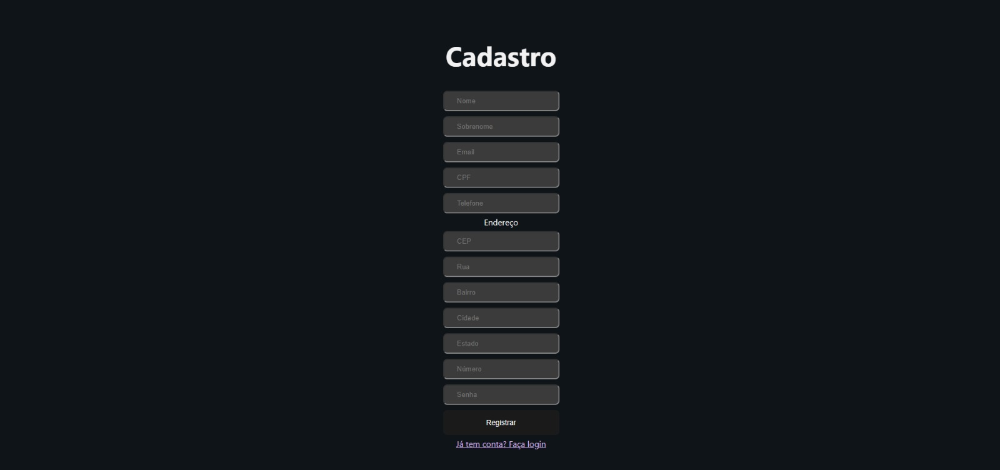
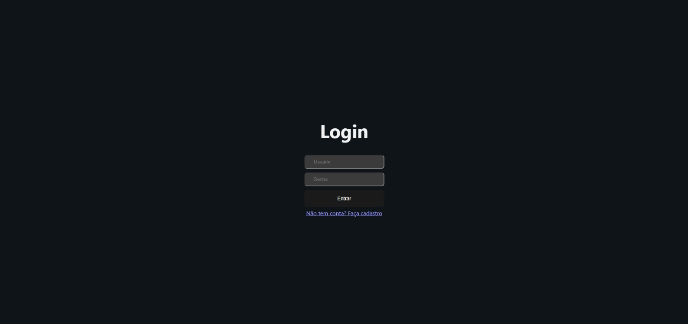

# 4. Projeto da Solução

---

## 4.1 Arquitetura da Solução (Sprint 1 e 2)


---


## 4.2 Tecnologias Utilizadas (Sprint 1)

Descreva as tecnologias, linguagens, frameworks, bibliotecas e serviços escolhidos pelo Squad.

| Dimensão | Tecnologia Escolhida |
|----------|----------------------|
| Banco de Dados (SGBD) | PostgreSQL e Prisma ORM |
| Back-end (API) | Node.js com TypeScript, Express 5, JWT e Bcrypt |
| Front-end / Mobile | React 19, Vite, Axios e Material UI (MUI) |
| Hospedagem / Deploy | Neon (Banco de Dados em nuvem) |
| Gestão e Versionamento | Git e GitHub |

---

##  4.3 Wireframes ou Mockups (A partir da Sprint 2)

Apresente os protótipos das telas (Wireframes/Mockups) apenas das funcionalidades que estão sendo implementadas na Sprint atual.

Cada Wireframe ou Mockups devem estar associados a pelo menos:

- Um Requisito Funcional (RF-XX)
- Uma História de Usuário


## 📌 Exemplo Ilustrativo – Tela de Cadastro (RF-01)

**História associada:** Como usuário, quero criar uma conta para acessar o sistema.

Representação simplificada do Wireframe:


**Descrição:** A interface contempla todos os campos exigidos pelo RF-01 e permite persistência no banco após validação no backend.

---


### 📎 Inserir AQUI Wireframes/ Mockups do Projeto de Software

#### Tela de Cadastro (RF-01)

**História associada:** Como morador de uma área de risco, eu quero criar uma conta fornecendo meus dados básicos e de localização para acessar o sistema de alertas.



**Descrição:** A interface contempla todos os campos exigidos pelo RF-01 (Nome, Sobrenome, Email, CPF, Telefone e Endereço completo) e permite a persistência no banco de dados nas tabelas `User` e `Address` após validação no backend.

---

#### Tela de Login (RF-02)

**História associada:** Como morador de uma área de risco, eu quero fazer login com minhas credenciais para acessar o painel do sistema de forma segura.



**Descrição:** A interface contempla os campos exigidos pelo RF-02 (Usuário/Email e Senha) e permite a autenticação, conectada à rota de login da API REST que valida as credenciais via Bcrypt.

## 4.4 Modelagem de Dados (Sprint 2 e 3)

O sistema exige persistência de dados.

A documentação do banco seguirá a abordagem de **entrega contínua**, sendo expandida conforme evolução do projeto.

---

### 4.4.1 Script Físico (Entrega na Sprint 2 - MVP)

Para a primeira fatia vertical (MVP), o Squad deverá entregar o **script de criação das tabelas ou coleções utilizadas**.

#### 🔹 Para Banco Relacional (SQL)

Incluir:

- Comandos `CREATE TABLE`
- Definição de chave primária (PK)
- Definição de chaves estrangeiras (FK)

**Exemplo:**

```sql
CREATE TABLE Usuario (
    Id INT PRIMARY KEY,
    Nome VARCHAR(100),
    Email VARCHAR(150) UNIQUE,
    Senha VARCHAR(200)
);
```
O código abaixo é o DDL gerado para estruturar nossa base de dados relacional (PostgreSQL) para a Sprint 2. 

*(O arquivo consolidado para execução `.sql` encontra-se na pasta `src/bd/schema.sql` do repositório).*

```sql
-- Criação do Enum
CREATE TYPE "UserRole" AS ENUM ('ADMIN', 'USER');

-- Tabela de Usuários
CREATE TABLE "User" (
    "id" TEXT NOT NULL,
    "name" TEXT NOT NULL,
    "lastName" TEXT NOT NULL,
    "email" TEXT NOT NULL,
    "cpf" TEXT NOT NULL,
    "phone" TEXT NOT NULL,
    "password" TEXT NOT NULL,
    "role" "UserRole" NOT NULL DEFAULT 'USER',
    "createdAt" TIMESTAMP(3) NOT NULL DEFAULT CURRENT_TIMESTAMP,

    CONSTRAINT "User_pkey" PRIMARY KEY ("id")
);

CREATE UNIQUE INDEX "User_email_key" ON "User"("email");
CREATE UNIQUE INDEX "User_cpf_key" ON "User"("cpf");

-- Tabela de Endereços
CREATE TABLE "Address" (
    "id" TEXT NOT NULL,
    "cep" TEXT NOT NULL,
    "street" TEXT NOT NULL,
    "neighborhood" TEXT NOT NULL,
    "city" TEXT NOT NULL,
    "state" TEXT NOT NULL,
    "number" TEXT NOT NULL,
    "userId" TEXT NOT NULL,

    CONSTRAINT "Address_pkey" PRIMARY KEY ("id")
);

CREATE UNIQUE INDEX "Address_userId_key" ON "Address"("userId");

ALTER TABLE "Address"
ADD CONSTRAINT "Address_userId_fkey"
FOREIGN KEY ("userId") REFERENCES "User"("id")
ON DELETE RESTRICT
ON UPDATE CASCADE;

-- Tabela de Comunidades
CREATE TABLE "Community" (
    "id" TEXT NOT NULL,
    "name" TEXT NOT NULL,
    "city" TEXT NOT NULL,
    "state" TEXT NOT NULL,
    "latitude" DOUBLE PRECISION,
    "longitude" DOUBLE PRECISION,
    "riskLevel" TEXT NOT NULL,
    "population" INTEGER,
    "description" TEXT,
    "createdAt" TIMESTAMP(3) NOT NULL DEFAULT CURRENT_TIMESTAMP,
    "updatedAt" TIMESTAMP(3) NOT NULL,

    CONSTRAINT "Community_pkey" PRIMARY KEY ("id")
);
```
---

### Para Banco NoSQL

Incluir a estrutura dos documentos JSON (Schema).

**Exemplo:**

```json
{
  "nome": "João Silva",
  "email": "joao@email.com",
  "senha": "hash_da_senha"
}
```

### 📁 Obrigatório

O arquivo .sql ou .js deve ser salvo na pasta: src/bd

 - É permitido colar um trecho do script no README apenas para visualização rápida.


---
### 4.4.2 Representação do Modelo Físico de Dados (Entrega na Sprint 3 - Core)


---

