# 4. Projeto da Solução

---

## 4.1 Arquitetura da Solução (Sprint 1 e 2)


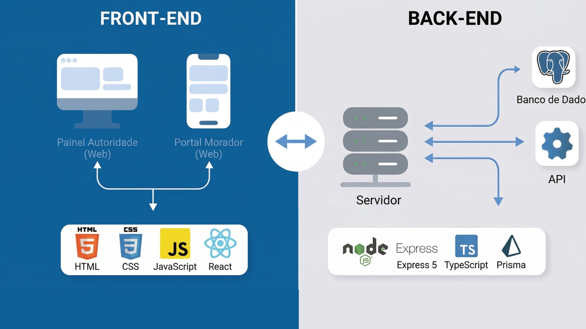

---


## 4.2 Tecnologias Utilizadas (Sprint 1)

Descreva as tecnologias, linguagens, frameworks, bibliotecas e serviços escolhidos pelo Squad.

| Dimensão | Tecnologia Escolhida |
|----------|----------------------|
| Banco de Dados (SGBD) | PostgreSQL e Prisma ORM |
| Back-end (API) | Node.js com TypeScript, Express 5, JWT e Bcrypt |
| Front-end / Mobile | React 19, Vite, Axios e Material UI (MUI) |
| Hospedagem / Deploy | Neon (Banco de Dados em nuvem) |
| Gestão e Versionamento | Git e GitHub |

---

##  4.3 Wireframes ou Mockups (A partir da Sprint 2)

Os mockups abaixo representam as principais telas implementadas no Nimbly. Eles foram organizados por funcionalidade e associados aos requisitos funcionais e histórias de usuário descritos na Seção 3.

#### Tela de Cadastro (RF-01)

**História associada:** Como morador de uma área de risco, eu quero criar uma conta fornecendo meus dados básicos e de localização para acessar o sistema de alertas.

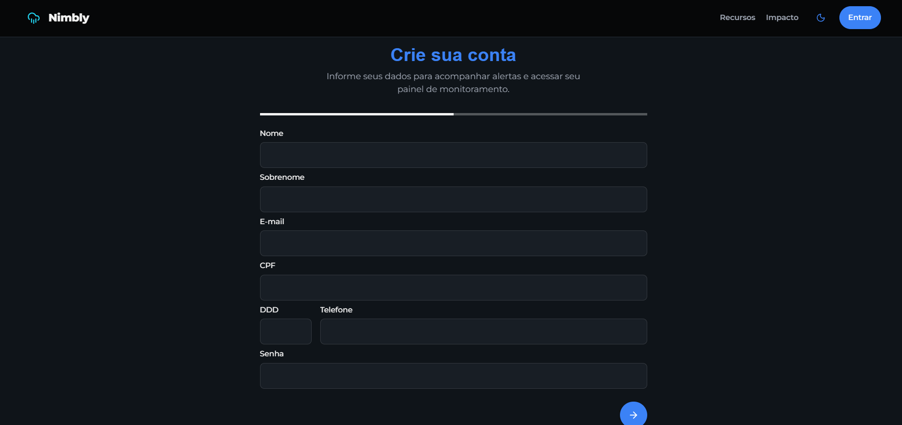

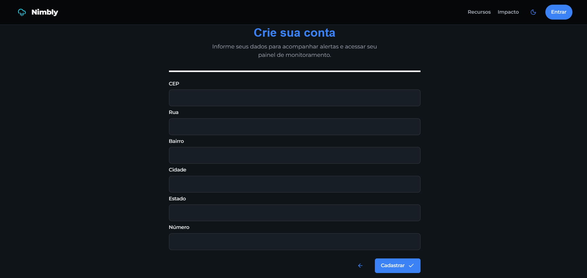

**Descrição:** A interface contempla os campos exigidos pelo RF-01, dividindo o cadastro em dados pessoais e endereço. A primeira etapa solicita nome, sobrenome, e-mail, CPF, DDD, telefone e senha. A segunda etapa coleta CEP, rua, bairro, cidade, estado e número, permitindo a persistência dos dados nas tabelas `User` e `Address` após validação no backend.

---

#### Tela de Login (RF-02)

**História associada:** Como morador de uma área de risco, eu quero fazer login com minhas credenciais para acessar o painel do sistema de forma segura.

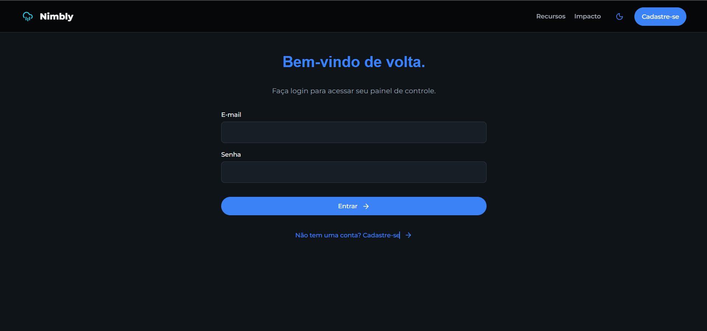

**Descrição:** A interface contempla os campos exigidos pelo RF-02 (e-mail e senha) e permite a autenticação do usuário, conectada à rota de login da API REST que valida as credenciais via Bcrypt e gera tokens de acesso.

---

#### Tela de Dashboard Climático (RF-07 e RF-08)

**História associada:** Como usuário logado, eu quero visualizar gráficos de chuva, vento e temperatura da minha região, para acompanhar as condições climáticas atuais e identificar possíveis níveis de alerta.

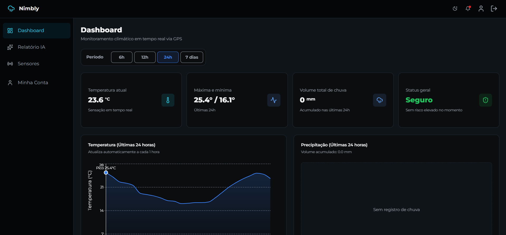

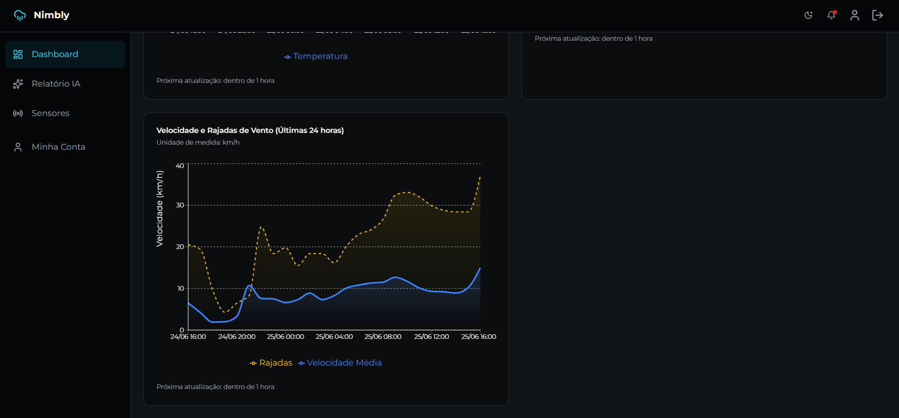

**Representação do wireframe:**


**Descrição:** A tela consolida os dados meteorológicos retornados pela integração climática, permitindo alternar o período de análise entre 6h, 12h, 24h e 7 dias. Os cards superiores resumem temperatura atual, máxima/mínima, volume de chuva e status geral, enquanto os gráficos detalham temperatura, precipitação e vento.

---

#### Tela de Sensores (RF-07 e RF-08)

**História associada:** Como usuário logado, eu quero visualizar os sensores disponíveis e seus status, para acompanhar a cobertura do monitoramento climático.

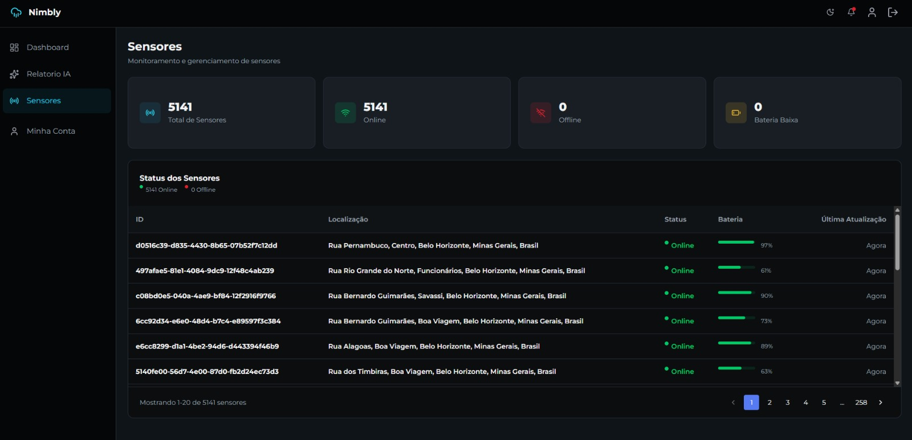

**Representação do wireframe:**


**Descrição:** A tela exibe indicadores gerais dos sensores cadastrados e uma tabela com localização, status, bateria e última atualização. O usuário pode navegar pela lista e acessar o detalhe de um sensor específico.

---

#### Tela de Detalhe do Sensor (RF-07 e RF-08)

**História associada:** Como usuário logado, eu quero consultar os detalhes de um sensor, para verificar sua localização, bateria, última comunicação e histórico de medições.

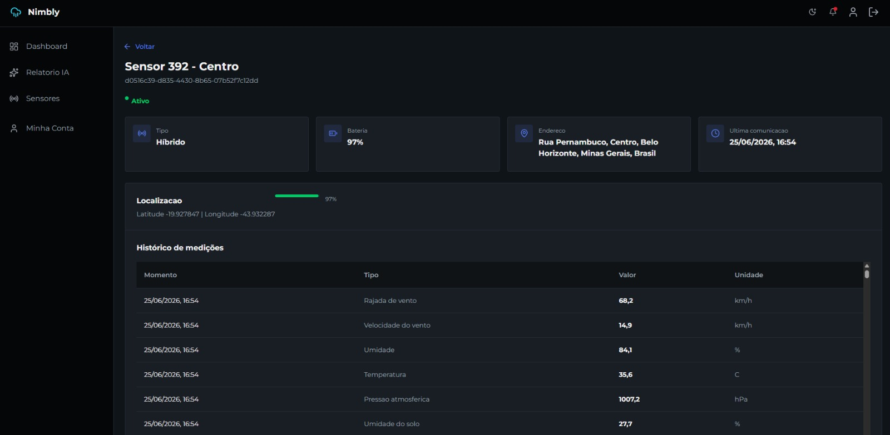

**Representação do wireframe:**


**Descrição:** O detalhe do sensor apresenta as informações técnicas e operacionais de um equipamento monitorado, incluindo tipo, bateria, endereço, localização geográfica, horário da última comunicação e histórico recente de medições.

---

#### Tela Minha Conta (RF-04)

**História associada:** Como usuário cadastrado, eu quero consultar e atualizar meus dados, para manter minhas informações pessoais e de endereço corretas no sistema.

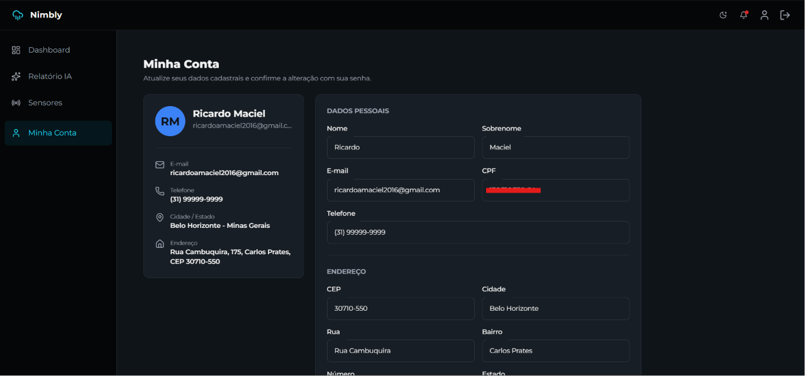

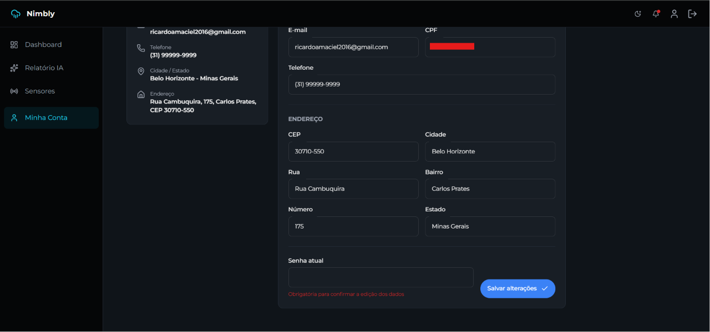

**Representação do wireframe:**


**Descrição:** A tela permite visualizar o resumo do perfil do usuário e editar dados pessoais, telefone e endereço. Para confirmar alterações, o sistema solicita a senha atual, reduzindo o risco de edição indevida dos dados cadastrais.

---

#### Tela de Relatório Inteligente (RF-07 e RF-08)

**História associada:** Como usuário logado, eu quero gerar uma análise textual dos dados meteorológicos, para compreender rapidamente o contexto de risco da minha região.

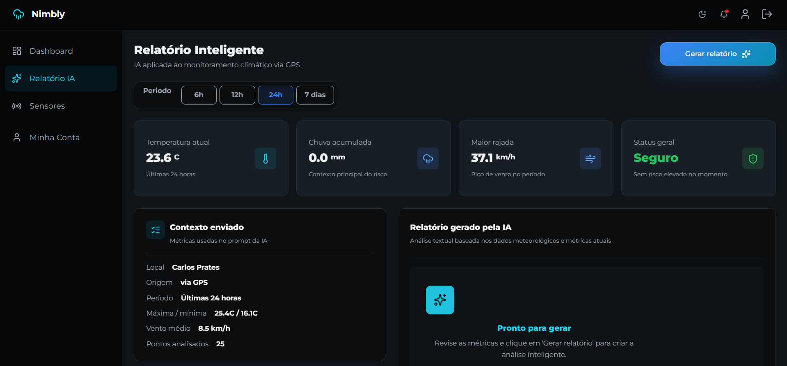

**Representação do wireframe:**


**Descrição:** A tela apresenta os dados usados como contexto da IA e permite gerar um relatório textual com base nas métricas climáticas atuais, como temperatura, chuva acumulada, vento médio, rajadas e status geral.

## 4.4 Modelagem de Dados (Sprint 2 e 3)

O Nimbly utiliza um banco de dados relacional PostgreSQL, acessado pelo back-end por meio do Prisma ORM. Essa escolha permite organizar os dados principais do sistema, como usuários, endereços, comunidades monitoradas e sensores ambientais.

A modelagem foi evoluindo conforme as sprints. No início, o foco foi permitir cadastro e autenticação de usuários. Depois, o banco foi ampliado para armazenar comunidades em risco e sensores usados no monitoramento climático.

---

### 4.4.1 Modelo Físico do Banco

O modelo físico atual está definido no arquivo `src/back-end/prisma/schema.prisma`, e as migrations ficam em `src/back-end/prisma/migrations`. Também existe um script SQL de apoio em `src/db/schema.sql`.

As principais entidades do banco são:

| Entidade | Finalidade |
|----------|------------|
| `User` | Armazena os dados dos usuários cadastrados no sistema |
| `Address` | Armazena o endereço vinculado a cada usuário |
| `Community` | Armazena comunidades ou áreas monitoradas |
| `Sensor` | Armazena sensores ambientais usados no monitoramento |

#### Usuários e endereços

A tabela `User` guarda os dados pessoais e de autenticação dos usuários. Cada usuário possui e-mail e CPF únicos, evitando cadastros duplicados. A coluna `role` define se o usuário é comum (`USER`) ou administrador (`ADMIN`).

A tabela `Address` guarda o endereço do usuário. O relacionamento entre `User` e `Address` é de um para um, pois cada endereço cadastrado pertence a um único usuário.

```sql
CREATE TYPE "UserRole" AS ENUM ('ADMIN', 'USER');

CREATE TABLE "User" (
    "id" TEXT NOT NULL,
    "name" TEXT NOT NULL,
    "lastName" TEXT NOT NULL,
    "email" TEXT NOT NULL,
    "cpf" TEXT NOT NULL,
    "phone" TEXT NOT NULL,
    "password" TEXT NOT NULL,
    "role" "UserRole" NOT NULL DEFAULT 'USER',
    "createdAt" TIMESTAMP(3) NOT NULL DEFAULT CURRENT_TIMESTAMP,

    CONSTRAINT "User_pkey" PRIMARY KEY ("id")
);

CREATE UNIQUE INDEX "User_email_key" ON "User"("email");
CREATE UNIQUE INDEX "User_cpf_key" ON "User"("cpf");

CREATE TABLE "Address" (
    "id" TEXT NOT NULL,
    "cep" TEXT NOT NULL,
    "street" TEXT NOT NULL,
    "neighborhood" TEXT NOT NULL,
    "city" TEXT NOT NULL,
    "state" TEXT,
    "number" TEXT NOT NULL,
    "userId" TEXT NOT NULL,

    CONSTRAINT "Address_pkey" PRIMARY KEY ("id")
);

CREATE UNIQUE INDEX "Address_userId_key" ON "Address"("userId");

ALTER TABLE "Address"
ADD CONSTRAINT "Address_userId_fkey"
FOREIGN KEY ("userId") REFERENCES "User"("id")
ON DELETE RESTRICT
ON UPDATE CASCADE;
```

#### Comunidades monitoradas

A tabela `Community` representa regiões acompanhadas pelo sistema. Ela armazena nome, cidade, estado, coordenadas geográficas, nível de risco, população estimada e descrição.

Esses dados ajudam o sistema a organizar áreas vulneráveis e apoiar a visualização de informações no painel.

```sql
CREATE TABLE "Community" (
    "id" TEXT NOT NULL,
    "name" TEXT NOT NULL,
    "city" TEXT NOT NULL,
    "state" TEXT NOT NULL,
    "latitude" DOUBLE PRECISION,
    "longitude" DOUBLE PRECISION,
    "riskLevel" TEXT NOT NULL,
    "population" INTEGER,
    "description" TEXT,
    "createdAt" TIMESTAMP(3) NOT NULL DEFAULT CURRENT_TIMESTAMP,
    "updatedAt" TIMESTAMP(3) NOT NULL,

    CONSTRAINT "Community_pkey" PRIMARY KEY ("id")
);
```

#### Sensores

A tabela `Sensor` registra os sensores usados no monitoramento. Ela permite armazenar nome, descrição, tipo do sensor, organização responsável, localização, status, bateria e data da última comunicação.

O campo `geom` foi preparado para recursos geográficos com PostGIS, permitindo evoluções futuras como busca por sensores próximos e associação automática com áreas monitoradas.

```sql
CREATE TYPE "SensorType" AS ENUM (
  'RAIN',
  'RIVER_LEVEL',
  'SOIL_MOISTURE',
  'WEATHER',
  'TEMPERATURE',
  'HUMIDITY'
);

CREATE TYPE "SensorStatus" AS ENUM (
  'ACTIVE',
  'INACTIVE',
  'MAINTENANCE',
  'OFFLINE'
);

CREATE TABLE "Sensor" (
    "id" TEXT NOT NULL,
    "name" TEXT NOT NULL,
    "description" TEXT,
    "type" "SensorType" NOT NULL,
    "organizationId" TEXT NOT NULL,
    "latitude" DOUBLE PRECISION NOT NULL,
    "longitude" DOUBLE PRECISION NOT NULL,
    "status" "SensorStatus" NOT NULL,
    "batteryLevel" INTEGER,
    "lastCommunicationAt" TIMESTAMP(3),
    "geom" geometry(Point, 4326),
    "createdAt" TIMESTAMP(3) NOT NULL DEFAULT CURRENT_TIMESTAMP,
    "updatedAt" TIMESTAMP(3) NOT NULL,

    CONSTRAINT "Sensor_pkey" PRIMARY KEY ("id")
);

CREATE INDEX "Sensor_organizationId_idx" ON "Sensor"("organizationId");
CREATE INDEX "Sensor_type_idx" ON "Sensor"("type");
CREATE INDEX "Sensor_status_idx" ON "Sensor"("status");
```

---

### 4.4.2 Relações e Regras da Modelagem

As principais regras representadas no banco são:

* Um usuário pode ter apenas um endereço cadastrado;
* O e-mail do usuário deve ser único;
* O CPF do usuário deve ser único;
* O papel do usuário é controlado pelo enum `UserRole`;
* Sensores possuem tipo e status controlados por enums;
* Sensores possuem índices por organização, tipo e status para facilitar filtros e consultas;
* Comunidades armazenam localização e nível de risco para apoiar o painel de monitoramento.

---

### 4.4.3 Representação do Modelo Físico de Dados

O diagrama abaixo representa a estrutura física do banco de dados utilizada pelo projeto.

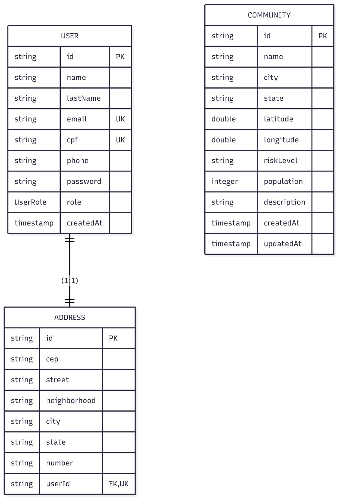

---

### 4.4.4 Diagrama de Classes

O diagrama de classes apresenta a visão das principais entidades usadas no sistema e sua relação com a implementação.

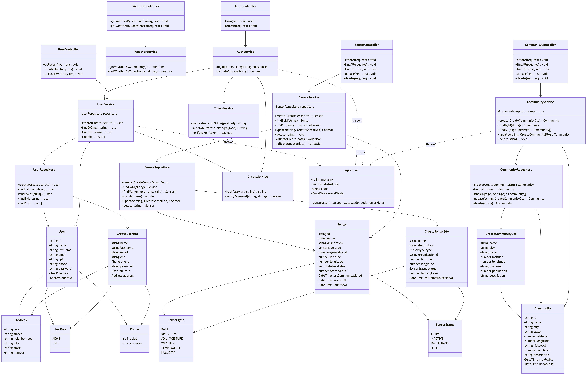
